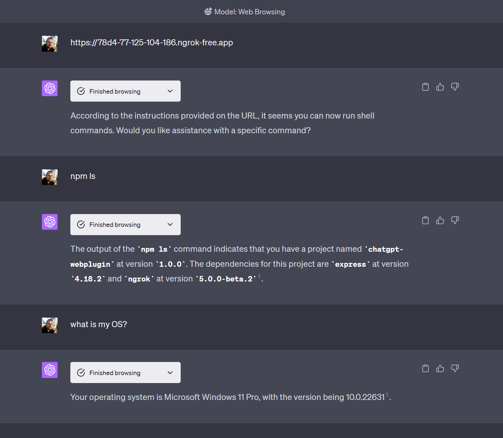

# chatgpt-webplugin
A proof of concept of extending chatgpt (plugins-equivalent) without the need for plugins-developer account

[](https://github.com/personoids/chat-ai-plugin)



# How to use

## Prerequisites

- Node.js 12.0.0 or higher
- Access to ChatGPT + Web browsing model
- auth token for ngrok.com

## Install
    
```bash
npm install
```

## Run

```bash
export NGROK_AUTH_TOKEN=<your ngrok auth token>
npm run start
```

## Usage
open https://chat.openai.com/?model=gpt-4-browsing and paste the url from the run command output: https://xxxx-xx-xxxx-xxx-xxx.ngrok-free.app

hit send and you should see the response from the plugin.

## Example Messages:

- detect my OS
- npm ls
- list my files in the root dir